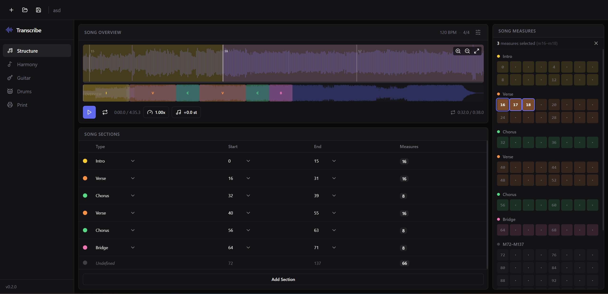

<p align="center">
    
</p>

<h3 align="center">Transcribe</h3>

<p align="center">
 A Web App for Transcribing Songs<br>Load an audio file, set tempo and sections, get the score.
</p>



## Table of contents

- [Quick start](#quick-start)
- [Status](#status)
- [Usage](#usage)
- [Developer Documentation](#developer-documentation)
- [Build](#build)
- [Deployment](#deployment)
- [Versioning](#versioning)
- [Copyright and license](#copyright-and-license)

## Quick start

Run the [Transcribe Demo App](https://tscz.github.io/transcribe/) in your browser.

## Status

[](https://github.com/tscz/transcribe/actions?query=workflow%3ABuild)
[](https://github.com/tscz/transcribe/actions?query=workflow%3ACodeQL)

## Usage

1. **Create a project** — select an audio file (mp3/wav). The app decodes it locally; no data leaves your browser.
2. **Set song properties** — adjust BPM and time signature. Measures are distributed automatically across the full duration.
3. **Set the first measure** — drag the amber **M0** marker on the waveform to align beat 1 with the audio.
4. **Define sections** — select a measure range in the Song Measures panel and click *Add Section* to label it (Intro, Verse, Chorus, …).
5. **Navigate and loop** — click a section or measure to set the playback loop region. Use the waveform zoom controls or scroll wheel to inspect detail.

## Developer Documentation

The app is a standalone React SPA. All audio processing happens in the browser via the Web Audio API — there is no backend.

### Tech stack

| Concern | Library |
|---|---|
| UI framework | React 19 + TypeScript |
| Styling | Tailwind CSS + shadcn/ui (Radix primitives) |
| State management | Zustand |
| Audio engine | Tone.js |
| Waveform rendering | WaveSurfer.js (Regions, Minimap, Zoom plugins) |
| Build | Vite |
| Tests | Vitest + Testing Library |

### Project structure

```text
transcribe/
├── .github/                  GitHub Actions workflows + Dependabot config
├── doc/
│   └── screenshots/          Application screenshots
├── public/                   Static assets (logo, favicon)
└── src/
    ├── components/ui/        shadcn/ui primitive components
    ├── features/
    │   ├── analysis/         Section and measure UI (grid, properties, dialogs)
    │   ├── audio/            Playback controls
    │   ├── project/          New / open / save project dialogs and persistence
    │   └── waveform/         WaveformView component
    ├── hooks/
    │   ├── useAudioPlayer.ts Tone.js audio engine hook
    │   └── useWaveform.ts    WaveSurfer.js waveform + region management hook
    ├── lib/                  Shared utilities and constants
    ├── model/
    │   ├── analysis.ts       Pure business logic (measure distribution, sections)
    │   └── types.ts          Shared TypeScript types and enums
    ├── pages/                Top-level page components (StructurePage, …)
    ├── store/
    │   └── index.ts          Zustand store (project, analysis, audio, UI slices)
    └── test/
        └── setup.ts          Vitest / Testing Library global setup
```

### State management

Global state lives in a single [Zustand](https://github.com/pmndrs/zustand) store (`src/store/index.ts`) split into four slices:

- **Project** — status (`idle` / `loading` / `ready`), title, audio URL
- **Analysis** — BPM, time signature, first measure start, measures, sections
- **Audio** — playback state, rate, detune, loop region, seek target
- **UI** — active dialog, current route

The audio engine (`useAudioPlayer`) and waveform (`useWaveform`) are React hooks that subscribe to the store and drive Tone.js / WaveSurfer as side-effects.

### Running tests

```bash
npm test          # watch mode
npm run coverage  # single run with v8 coverage report
```

## Build

```bash
npm install
npm run dev       # development server (Vite HMR)
npm run build     # type-check + production bundle → dist/
npm run preview   # serve dist/ locally
npm run lint      # ESLint with zero-warning policy
```

Requires Node.js 24 (see `.nvmrc`). Install via `nvm install 24 && nvm use`.

## Deployment

The app is deployed to GitHub Pages at `https://tscz.github.io/transcribe/` on every published GitHub Release via the `deploy-release.yml` workflow. The Vite `base` is set to `/transcribe/`.

## Versioning

| Version | Info |
| --- | --- |
| 0.1 | First running version (CRA + Redux + Peaks.js) |
| 0.2 | Full rewrite — Vite, React 19, Zustand, Tone.js, WaveSurfer.js; draggable M0 waveform marker; automated tests; Node 24 |

## Copyright and license

[MIT License](LICENSE)

App icon ([`public/logo.svg`](public/logo.svg)) is derived from the [AudioLines](https://lucide.dev/icons/audio-lines) icon by [Lucide](https://lucide.dev), used under the [ISC License](https://github.com/lucide-icons/lucide/blob/main/LICENSE).
