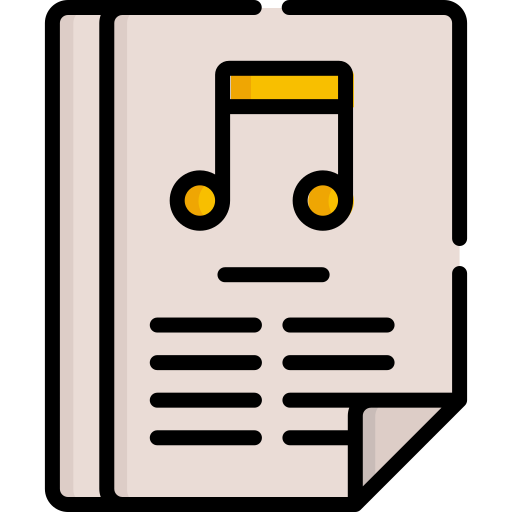
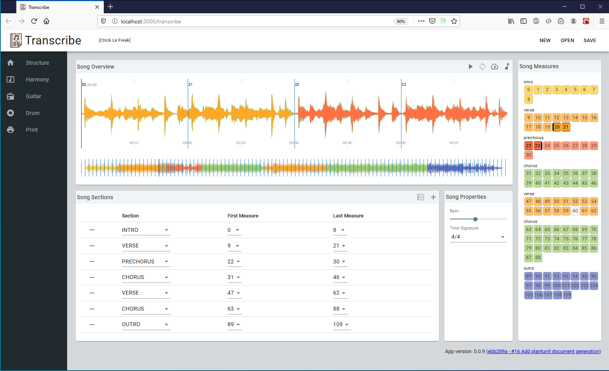
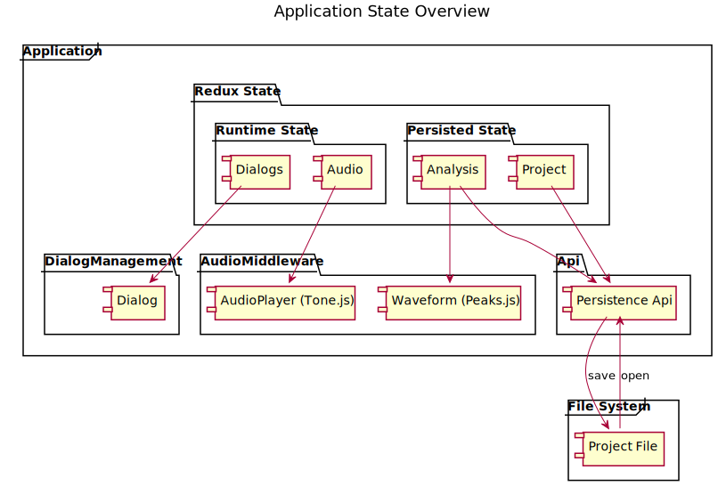
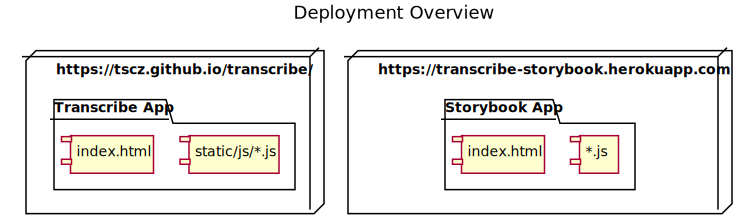

<p align="center">
    
</p>

<h3 align="center">Transcribe</h3>

<p align="center">
 A Web App for Transcribing Songs<br>Load mp3, transcribe song, get the score.
</p>



## Table of contents

- [Quick start](#quick-start)
- [Status](#status)
- [Usage](#usage)
- [Developer Documentation](#developer-documentation)
- [Build](#build)
- [Deployment](#deployment)
- [Versioning](#versioning)
- [Copyright and license](#copyright-and-license)

## Quick start

Run the [Transcribe Demo App](https://tscz.github.com/transcribe) in your Browser.

## Status

[](https://github.com/tscz/transcribe/actions?query=workflow%3A%22Build+application%22)
[](https://coveralls.io/github/tscz/transcribe?branch=master)
[](https://github.com/tscz/transcribe/releases/latest)
[](https://transcribe-storybook.herokuapp.com)
[](https://sonarcloud.io/dashboard?id=tscz_transcribe)

## Usage
Firstly, create a new transcription project and select an audio file of the song you want to transcribe.

Then you can set basic song properties (like the BPM and time signature).

Next step is then splitting the song in song sections.

## Developer Documentation
The app is a standalone React app using Webaudio APIs locally without any backend system. 

### Project Structure
```text
transcribe/
└── .github/        (Github Action config)
└── .storybook/     (Storybook config)
└── .vscode/        (Visual Studio Code config)
└── doc/
    ├── diagrams/   (PlantUml diagrams and generation scripts)
└── public/         (Static app content)
└── src/
    ├── api/        (External interfaces)
    ├── components/ (React components)
    ├── model/      (Application business model)
    ├── pages/      (Application pages)
    ├── states/     (Application state definition and middleware based on Redux)
    ├── styles/     (CSS and theme definitions)
    ├── tests/      (Testing utilities)
    ├── util/       (Application utilities)
    ├── views/      (Application views)
    ├── index.tsx   (Main Application Entry Point)
└── package.json    (Build and script config)
└── tsconfig.json   (Typescript compiler config)

```
### Application State
The state management is based on Redux. It integrates Tone.js (for audio playback and sequencer) and Peaks.js (for waveform rendering and audio navigation).



A redux middleware is controlling the audio player and waveform as side-effects of state transitions.


### Component documentation
See [Storybook](https://transcribe-storybook.herokuapp.com) for Component Documentation.

## Build
See [Build](https://github.com/tscz/transcribe/wiki/Build) description in project wiki.

## Deployment


## Versioning
| Version | Info
| --- | --- 
| 0.1 | First running version (see https://github.com/tscz/transcribe/projects/1)

## Copyright and license
This project is licensed under the MIT License - see the [LICENSE](LICENSE) file for details

<div>Icons made by <a href="https://www.flaticon.com/authors/freepik" title="Freepik">Freepik</a> from <a href="https://www.flaticon.com/" title="Flaticon">www.flaticon.com</a></div>
